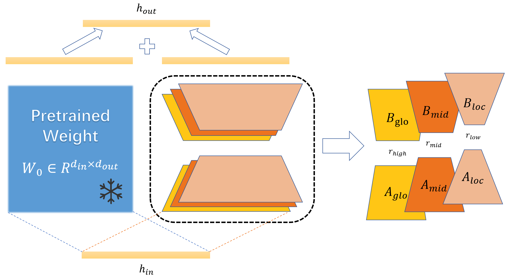

# MSPLoRA
MSPLoRA is a parameter-efficient fine-tuning framework that decouples global, mid-level, and fine-grained information via a multi-scale pyramid of LoRA modules, achieving higher adaptability with fewer parameters.
## Method Overview
<div align=center> 

</div> 

## Quickstart
1. Install dependencies

   ```bash
   conda create -n MSPLoRA python=3.10
   conda activate MSPLoRA
   pip install torch==2.0.1
   pip install -r requirements.txt
   ```

   ```bash
   cd peft-0.5.0
   pip install -e .
   ```

2. Run experiments

fill in the `--model_name_or_path` `--wandb_project` and `--output_dir` in `llama_finetune.sh` and `glue_finetune.sh` with the path to the model and the output directory.

### Instruction Tuning
```bash
bash llama_finetune.sh
```

### NLU

```bash
bash glue_finetune.sh
```
## Thanks

Code is largely based on [AGI-Edgerunners/LLM-Adapters](https://github.com/AGI-Edgerunners/LLM-Adapters), [huggingface/peft](https://github.com/huggingface/peft), [huggingface/transformers](https://github.com/huggingface/transformers)
